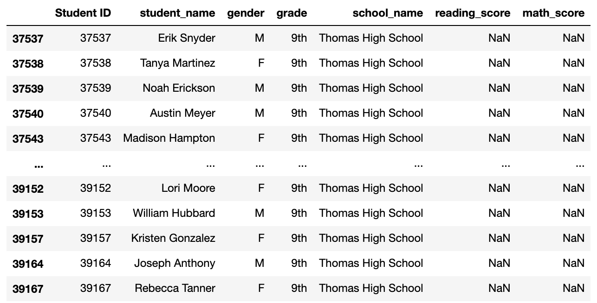
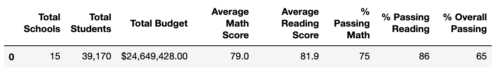
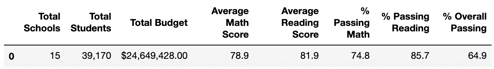
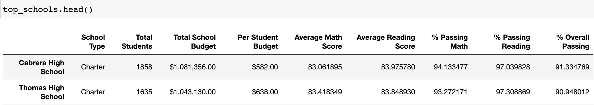
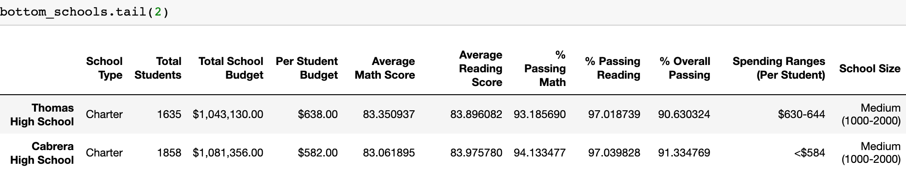
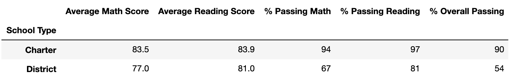
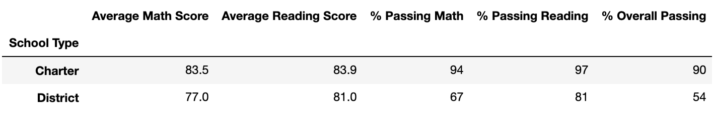

# School_District_Analysis
This project was writtern with Anaconda and Jupyter Notebook under PythonData environment.  Pandas, numpy libraries and csv file was imported for compliting this project.

## Overview of the school district analysis: Explain the purpose of this analysis.
This project was writtern for a school board who has notified by the evidence of academic dishonesty.  The evidence points to the risk that the students' reading and math grades of ninth grade students was changed in Thomas High School.  For this reason, two actions was taken to deduct the facts of data change on overall analysis:
  1. Reading and Math scores for ninth-grade Thomas High School students was adjusted
  2. School district analysis was repeated.

In this analysis, Jupyter Notebook was used for data outputs. New outputs are compared with the older version to determine the influnces of score change on 9th grade students from Thomas High School.

## Results: Using bulleted lists and images of DataFrames as support, address the following questions.

- **How is the district summary affected?**
The students scores lost accuracy bacause of the data missing.  The student's overall grades in Thomas High School were evaluation with bias. The standard of students' grade and teaching efficiency for Thomas High School would occur an underestimate after the score adjusted. The referance value of students' grade in district summary was reduced, while the other information (for eaxmple size and budget) remains the same.

Total average scores and passing rate was deducted, but the difference was little which coould be ignored.

Before:

After:

- **How is the school summary affected?**

For Thomas High School, average score and passing percentage was deducted but not significant.
Overall Passing Rate Before: 65%
Overall Passing Rate After: 64.5%

- **How does replacing the ninth graders’ math and reading scores affect Thomas High School’s performance relative to the other schools?**

Before Adjusting, Thomas High School performes good (as the 2nd in ranking), after adjusting, the Thomas is still the 2th in ranking system.

Before(ascending):

After(decending):

- **How does replacing the ninth-grade scores affect the following:**

  * **Math and reading scores by grade:** 
  Only the scores of 9th grade was influnced (deducted to 0), the other grades' scores remains the same. 461 students (in 9th grade) have no score counted.
  
  * **Scores by school spending:** 
  School spending do not influence the score, but the score decreased influed the rate on return of spendind.  After the score adjust (decrease), the payers spend more money on each higher score point, which means the efficiency of invest on study in Thomas High school decreased. 
  
  * **Scores by school size:** 
  Becasued the school size was not changed, but the number of students with valid score decrease. As a result, after the adjustment, average score and overall pasing rate decreased while total countable score deducted.
  
  * **Scores by school type:** 
Because of the deduction on average scoure and pasing rate, the total rates based on school types, which Thomas High School belongs to, also deducted for the same reasons for the school type. However, the difference is not significant based on the large volume of data source.

Before:

After:

## Summary: 

The 4 main changes after replace with NaNs is the decreasing value in average scores and passing percentage for Thomas High School:
  1. Change on student with valid Score (461 students deducted in total number)
  2. Change on Average Score bacauses of the duction on total counted score
  3. All 9th grade student was regared to "fail" due to the score adjusted to NaN
  4. Change on passing rate deducted
  
However, the most results for other schools did not occur a changes.

In this project, **loc** function was used for removing the scores for the 9th grade students in Thomas High school.  **Data frames** was issued for visualizations. Mathemetic functions was used to culculate the **average**, **percentage and etc.**.  Data **formart** was aproved on the final results for deliver the results more efficient.

More datails refers to PyCitySchools_Challenge.ipynb 
